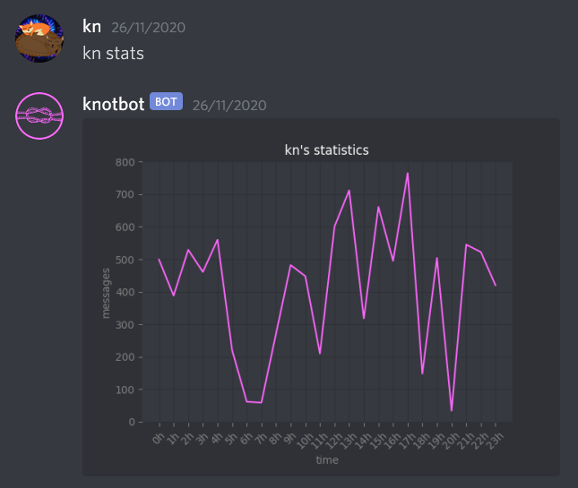

# knotbot

A Discord bot used mostly for stats and an advanced ranking system including elo counting from voice channel activity

## Usage

```bash
python3 -m main <token>
```

## Example stats


## Contributing
Pull requests are welcome.

Please make sure to update tests as appropriate.

## License
[The Unlicense](https://unlicense.org/)
